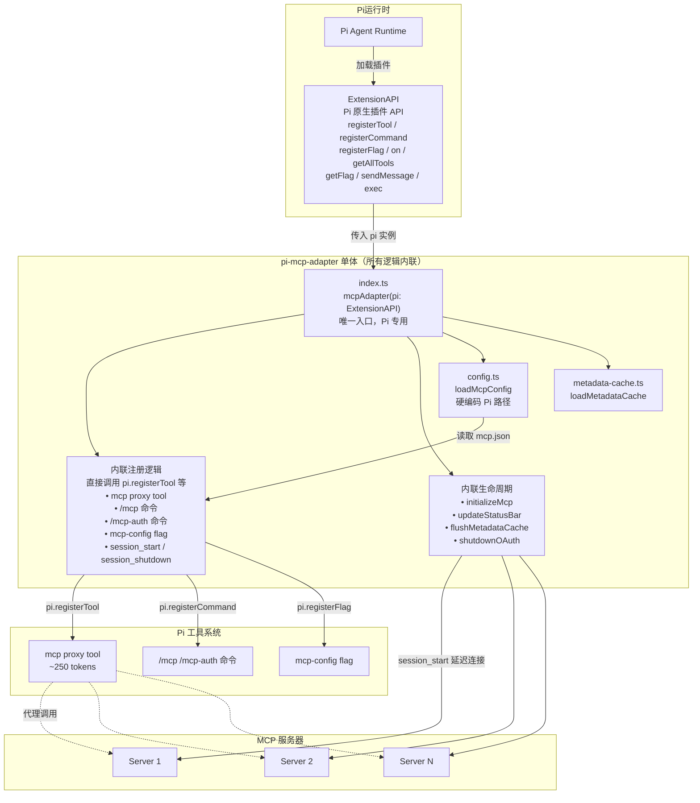
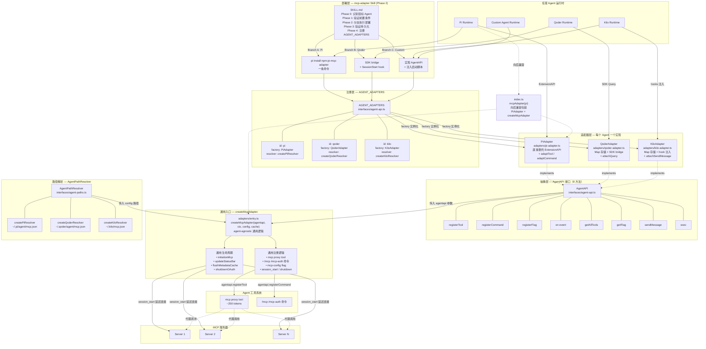
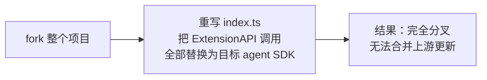
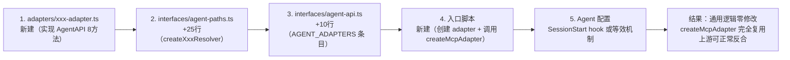

# mcp-adapter FAQ

> 本文档收录 mcp-adapter 架构设计中的常见问题、取舍分析和流程对比。
> 新的 FAQ 可以追加到对应章节末尾。

---

## 目录

- [架构演化](#架构演化)
  - [Q1: 原始 pi-mcp-adapter 和当前 for-every-agent mcp-adapter 的流程有什么区别？](#q1-原始-pi-mcp-adapter-和当前-for-every-agent-mcp-adapter-的流程有什么区别)
  - [Q2: AgentAPI 接口是一开始就有的吗？](#q2-agentapi-接口是一开始就有的吗)
- [适配器设计](#适配器设计)
  - [Q3: 为什么每个 agent 需要单独的适配器？有了 Skill，启动脚本不应该都一样吗？](#q3-为什么每个-agent-需要单独的适配器有了-skill启动脚本不应该都一样吗)
  - [Q4: Skill 和 Adapter 的职责边界是什么？](#q4-skill-和-adapter-的职责边界是什么)
  - [Q5: 新增一个 Agent 需要改哪些代码？](#q5-新增一个-agent-需要改哪些代码)
- [取舍分析](#取舍分析)
  - [Q6: 适配器之间的代码重复是必须的吗？为什么不提取基类？](#q6-适配器之间的代码重复是必须的吗为什么不提取基类)
  - [Q7: unknown 类型是否牺牲了类型安全？](#q7-unknown-类型是否牺牲了类型安全)
- [部署与运行时](#部署与运行时)
  - [Q8: 不同 Agent 的部署方式有什么差异？](#q8-不同-agent-的部署方式有什么差异)
  - [Q9: 向后兼容是如何保证的？](#q9-向后兼容是如何保证的)
- [如何贡献新 FAQ](#如何贡献新-faq)

---

## 架构演化

### Q1: 原始 pi-mcp-adapter 和当前 for-every-agent mcp-adapter 的流程有什么区别？

**原始 pi-mcp-adapter**（上游 `nicobailon/pi-mcp-adapter`）是 Pi 专用单体架构，所有逻辑直接耦合 Pi 的 `ExtensionAPI`，没有抽象层。

**当前 mcp-adapter**（fork `njuptlzf/mcp-adapter`）引入了 `AgentAPI` 抽象层，任何 agent 只需实现 8 个方法即可接入，核心逻辑完全 agent-agnostic。

#### 图 1：原始 pi-mcp-adapter 流程（Pi-only，无 AgentAPI）



**原始架构特征：**
- 无 `AgentAPI` 接口 — 直接用 Pi 的 `ExtensionAPI`
- 无 `adapters/` 目录 — 所有逻辑在 `index.ts` 内联
- 无 `AGENT_ADAPTERS` 注册表
- 无 `AgentPathResolver` — 配置路径硬编码为 Pi 的路径
- 无 `createMcpAdapter` 通用入口 — 只有 `mcpAdapter(pi)` Pi 专用函数
- 无法支持其他 agent — 想支持 Qoder 就得 fork 整个项目重写

#### 图 2：当前 for-every-agent mcp-adapter 流程（引入 AgentAPI）



**当前架构特征：**
- `AgentAPI` 接口（8 方法）作为 agent-agnostic 抽象合约
- `createMcpAdapter(agentapi, ctx, config, cache)` 通用入口，所有注册逻辑在此完成
- 每个 agent 一个 Adapter 实现（`PiAdapter` / `QoderAdapter` / `KiloAdapter`）
- `AGENT_ADAPTERS` 注册表支持动态发现
- `AgentPathResolver` 抽象配置路径
- `index.ts` 保留 `mcpAdapter(pi)` 向后兼容包装

---

### Q2: AgentAPI 接口是一开始就有的吗？

**不是。** `AgentAPI` 是 fork 后为通用化引入的抽象层，原始上游 pi-mcp-adapter 中不存在。

从代码可以确认：
- 原始上游只有一个 `mcpAdapter(pi: ExtensionAPI)` 函数，直接对接 Pi 的原生 API
- `AgentAPI`、`AgentContext`、`UISystem`、`AgentPathResolver`、`AGENT_ADAPTERS` 都是 fork 后新增的
- `PiAdapter` 是为了把 Pi 的 `ExtensionAPI` 适配到 `AgentAPI` 接口而创建的包装层
- `adapters/entry.ts` 中的 `createMcpAdapter` 是取代原始内联逻辑的通用入口

详细的改造过程记录在 [architecture-comparison.md](architecture-comparison.md) 中。

---

## 适配器设计

### Q3: 为什么每个 agent 需要单独的适配器？有了 Skill，启动脚本不应该都一样吗？

**不一样。** Skill 和 Adapter 解决的是两个不同层面的问题：

| 层面 | 通用还是专用？ | 原因 |
|------|--------------|------|
| **Skill（部署流程）** | 通用 | 所有 agent 的部署流程类似：识别 → 检查 → 安装 → 验证 |
| **createMcpAdapter（核心逻辑）** | 通用 | 注册 proxy tool、命令、生命周期 — 逻辑完全相同 |
| **AgentAPI 接口** | 通用 | 8 方法的抽象合约，所有 agent 共用 |
| **具体 Adapter 实现** | 专用 | 每个 agent 的原生 API 不同，必须各自实现 |
| **AgentPathResolver** | 专用 | 每个 agent 的配置目录不同 |

**Skill 解决部署流程问题**（怎么装进去），**Adapter 解决运行时 API 对接问题**（怎么跟 agent 的工具注册系统说话）。即使 Skill 统一了部署流程，运行时每个 agent 的 API 仍然不同：

- **Pi** 有原生 `ExtensionAPI`，直接调用 `pi.registerTool()`
- **Qoder** 用 SDK bridge，通过 `Query.streamInput` 交互
- **Kilo** 没有 SDK，通过 hooks 注入 + Map 存储 + 回调模拟

这些差异无法用一个通用启动脚本消除 — 因为每个 agent 的运行时 API 签名根本不一样。

---

### Q4: Skill 和 Adapter 的职责边界是什么？

```
┌─────────────────────────────────────────────────────────────────┐
│                    mcp-adapter Skill (Phase 2)                    │
│                                                                 │
│  职责：部署流程通用化                                           │
│  • 识别目标 Agent                                               │
│  • 验证前置条件（Node.js / npx / 配置文件）                     │
│  • 分支执行部署（Pi 一条命令 / Qoder SDK / Custom AgentAPI）    │
│  • 验证持久化（SessionStart hook 是否正确触发）                 │
│  • 注册到 AGENT_ADAPTERS                                        │
│                                                                 │
│  不负责：运行时 API 对接                                        │
├─────────────────────────────────────────────────────────────────┤
│                    AgentAPI Adapter 实现                         │
│                                                                 │
│  职责：运行时 API 差异化                                        │
│  • 实现 AgentAPI 的 8 个方法                                    │
│  • 将通用调用转换为 agent 原生 API 调用                         │
│  • 处理上下文转换（AgentContext ↔ 原生 Context）                │
│  • 处理 UI 系统适配（UISystem ↔ 原生 UI）                       │
│  • 提供事件模拟（如 fireSessionStart / fireSessionShutdown）    │
│                                                                 │
│  不负责：部署流程                                               │
├─────────────────────────────────────────────────────────────────┤
│                    createMcpAdapter 通用入口                     │
│                                                                 │
│  职责：核心注册逻辑（agent-agnostic）                           │
│  • 注册 mcp proxy tool（~250 tokens）                           │
│  • 注册 /mcp、/mcp-auth 命令                                    │
│  • 注册 mcp-config flag                                         │
│  • 注册 session_start / session_shutdown 生命周期               │
│  • 初始化 MCP 服务器连接                                        │
│                                                                 │
│  不负责：agent 特定的 API 对接                                  │
└─────────────────────────────────────────────────────────────────┘
```

---

### Q5: 新增一个 Agent 需要改哪些代码？

#### 原始架构（fork 整个项目重写）



#### 当前架构（只加不改）



以 Kilo 为例，新增需要 5 个文件变更：
1. `adapters/kilo-adapter.ts` — 新建，~266 行，实现 AgentAPI
2. `interfaces/agent-paths.ts` — +25 行，添加 `createKiloResolver()`
3. `interfaces/agent-api.ts` — +10 行，在 `AGENT_ADAPTERS` 注册 Kilo 条目
4. `.kilo/mcp-adapter-entry.ts` — 新建入口脚本
5. `~/.config/kilo/settings.json` — SessionStart hook 配置

**核心逻辑（`adapters/entry.ts`、`init.ts`、`proxy-modes.ts` 等）零修改。**

---

## 取舍分析

### Q6: 适配器之间的代码重复是必须的吗？为什么不提取基类？

**Adapter 实现是必须的**（因为 agent 的运行时 API 不同），但**代码重复不是必须的**。

当前 `KiloAdapter`（266 行）有约 200 行与 `QoderAdapter` 几乎相同 — 主要是 Map 存储、事件模拟器、UI no-op 实现等。可以通过提取 `BaseAgentAdapter` 基类压缩到约 50 行：

```typescript
// 理想结构（未来优化方向）
abstract class BaseAgentAdapter implements AgentAPI {
  protected tools = new Map<string, ToolRegistration>();
  protected commands = new Map<string, CommandConfig>();
  protected flags = new Map<string, FlagConfig>();
  protected eventHandlers = new Map<string, Function[]>();

  // 通用实现：8 方法中的 6 个可以默认实现
  registerTool(tool) { this.tools.set(tool.name, tool); }
  getAllTools() { return [...this.tools.values()]; }
  // ... 其余通用方法

  // 子类只需覆盖差异部分
  abstract sendMessage(message: unknown, options?: unknown): void;
  abstract exec(command: string, args: string[]): Promise<unknown>;
}

class KiloAdapter extends BaseAgentAdapter {
  // 仅 ~50 行：sendMessage + exec + UI 配置
}
```

**当前没有做这一步的原因是反合友好性的 trade-off：**

| 方案 | 优点 | 缺点 |
|------|------|------|
| **保持现状（代码重复）** | 文件结构与上游一致，反合冲突最小 | 适配器间有 ~200 行重复代码 |
| **提取 BaseAgentAdapter 基类** | 新适配器从 266 行压缩到 ~50 行 | 改变文件结构，增加上游 merge 冲突风险 |

反合友好性是本项目的核心设计约束（详见 [UPSTREAM-CHANGES.md](../UPSTREAM-CHANGES.md)），因此当前选择了代码重复但反合友好的方案。如果未来上游稳定或反合需求降低，可以再提取基类。

---

### Q7: unknown 类型是否牺牲了类型安全？

`AgentAPI` 的方法签名使用了 `unknown` 类型（如 `sendMessage(message: unknown, options?: unknown)`），看起来丢掉了编译期类型安全。但实际上这是可接受的：

1. **不同 agent 的类型完全不同**：Pi 是 `ExtensionMessage`，Qoder 是 SDK 特定类型，无法用联合类型覆盖
2. **调用点有限**：`sendMessage` 在核心逻辑中只有 3 个调用点，运行时类型错误会立即暴露
3. **Adapter 层做了 cast**：出错边界清晰 — 要么是 adapter 写错了，要么是调用方传了错的类型

这是 **"宽接口、严实现"** 的策略 — 接口层面接受任何输入，adapter 层面确保正确转换。

| 维度 | 原仓库 | Fork | 权衡 |
|------|--------|------|------|
| **类型安全** | Pi 类型精确匹配，编译期检查 | `unknown` 类型，运行时断言 | 牺牲编译期安全换跨 agent 兼容 |
| **依赖耦合** | Pi 包是 hard dependency | Pi 包是 optional peerDependency | 非 Pi 用户无需安装 Pi |
| **文件改动面** | 换 agent 要改 10+ 文件 | 换 agent 只需写 1 个 adapter 文件 | 维护成本从 O(n) 降到 O(1) |
| **上游合并** | — | Adapter 层隔离，core logic 不变 | 可继续从上游 cherry-pick |
| **测试复杂度** | 需要真实 Pi 环境 | MockAgent 可独立测试全部逻辑 | 测试不依赖特定 agent 运行时 |
| **API 表面积** | 暴露 Pi 内部类型 | 暴露 3 个通用接口 + 8 个方法 | 新 agent 开发者学习成本极低 |

---

## 部署与运行时

### Q8: 不同 Agent 的部署方式有什么差异？

| Agent | 部署方式 | 配置位置 | 启动机制 |
|-------|---------|---------|---------|
| **Pi** | `pi install npm:pi-mcp-adapter` 一条命令 | `~/.pi/agent/mcp.json` | Pi 原生插件加载 |
| **Qoder** | SDK bridge + SessionStart hook | `~/.qoder/agent/mcp.json` | `~/.qoder/settings.json` 中的 SessionStart hook |
| **Kilo** | 手动入口脚本 + SessionStart hook | `~/.kilo/mcp.json` | `~/.config/kilo/settings.json` 中的 SessionStart hook |
| **Custom** | 实现 AgentAPI + 注入启动脚本 | 自定义路径 | Agent 特定的启动机制 |

**Pi 是最简单的** — 原生支持插件安装，一条命令搞定。
**Qoder 和 Kilo 类似** — 都通过 SessionStart hook 在会话启动时注入入口脚本。
**Custom Agent** 需要根据 agent 的扩展机制选择合适的注入点。

---

### Q9: 向后兼容是如何保证的？

`index.ts` 保留了原始的 `mcpAdapter(pi: ExtensionAPI)` 默认导出，内部委托给 `PiAdapter` + `createMcpAdapter`：

```typescript
// index.ts — 向后兼容包装
export default function mcpAdapter(pi: ExtensionAPI) {
  const agentapi = new PiAdapter(pi);           // 创建 Pi 适配器
  const ctx = adaptPiContext(...);              // 转换上下文
  createMcpAdapter(agentapi, ctx, config, cache); // 委托通用入口
}

// 同时导出 piMcpAdapter 别名（D-15）
export { default as piMcpAdapter } from "./index.ts";
```

这意味着：
- 现有 Pi 用户 `import { piMcpAdapter } from "pi-mcp-adapter"` 无需任何修改
- 原始 `mcpAdapter(pi)` 调用方式完全保留
- 新用户可以直接使用 `createMcpAdapter` + 自定义 Adapter

---

## 如何贡献新 FAQ

1. 在对应章节末尾添加新的 Q&A 条目
2. 如果是新主题，创建新的 `## 章节` 并更新[目录](#目录)
3. 图示优先使用 Mermaid 语法（本项目 `<generating_mermaid_diagrams>` 规范：不含样式定义）
4. 涉及代码引用时使用相对路径链接，如 `[adapters/entry.ts](../adapters/entry.ts)`
5. 取舍分析使用表格对比，明确标注 trade-off
